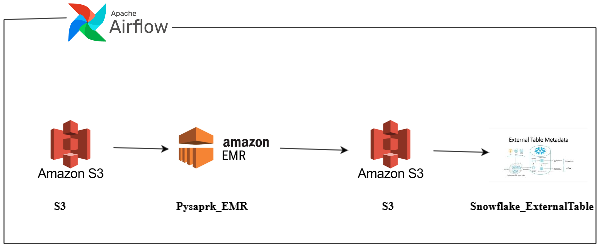
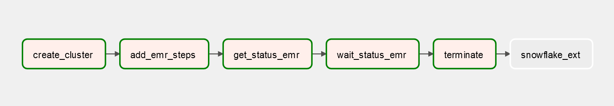

# **AWS_EMR**
I have created an EMR pipeline in Airflow. Initially, the data is stored in AWS S3. Using boto3 within Airflow, we will create an EMR cluster to transform and clean the data. After processing, the transformed data will be stored back in S3. Next, we will create a Snowflake external table to access the processed data directly from S3. Finally, the pipeline will use Airflow to connect with Snowflake, ensuring smooth integration between the systems.

BELOW IS THE  ARCHITECTURE OF THE EMR PIPELINE

 ## Overview
### Create an EMR Cluster
The pipeline begins by creating an Elastic MapReduce (EMR) cluster using the boto3 library within Airflow. EMR is a managed cluster platform that simplifies running big data frameworks like Apache Spark and Hadoop on AWS. In this pipeline, the cluster is configured with both Master and Core nodes, using the m5.xlarge instance type for scalable compute power. The cluster is set to remain active after tasks complete, allowing multiple jobs to run without re-creating the infrastructure. The necessary IAM roles and security configurations are passed during the cluster creation step to ensure smooth execution.
### Add Spark Job to EMR
Once the cluster is ready, a Spark job is submitted using the command-runner.jar. Spark is chosen for its efficiency in processing large datasets in parallel. The Spark job in this case, defined in the tran1.py script stored in S3, performs the transformation and cleaning of raw data. The job runs in cluster mode, meaning that the processing is distributed across the nodes in the cluster, ensuring that the data transformations are completed efficiently even with large datasets. This is the [Pyspark Code](first.py) 
and for the transformation of dataset I used dummy code . You can try cleaning and transforming and changing the format while uploading it to S3 [ Dummy Transformation Code](tran1.py)
### Wait for Job Completion
To monitor the progress of the Spark job, the DAG periodically checks the job’s status using the describe_step() function. If the step  is not completed it will goes to else loop and waits for some time and again it will check the status of step . Until it completes the terminate EMR Cluster task will not run.
### Terminate EMR Cluster
After the Spark job completes successfully, the DAG terminates the EMR cluster to prevent additional costs. Since EMR pricing is based on usage time, terminating the cluster promptly is essential for keeping the solution cost-effective. This is done through the terminate_job_flows() function in boto3, which ensures that all resources associated with the cluster are properly released.
### Refresh Snowflake External Table
Once the transformed data is stored back in S3, the pipeline triggers a Snowflake external table refresh using the SnowflakeOperator in Airflow. External tables in Snowflake allow direct access to data stored in S3 without physically importing it, offering a highly efficient way to manage large datasets. By refreshing the table, the latest version of the transformed data becomes available in Snowflake, ensuring that analysts and downstream processes always have access to the most up-to-date information.

This is the Airflow graph for the above tasks 
